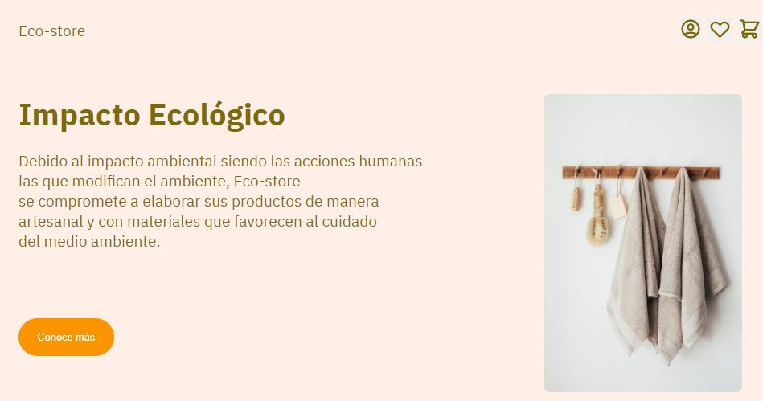

# Eco Store

Accede a la página [aquí](https://miguelvasquezal.github.io/eco-store.io/).
Proyecto Eco Store: tienda en línea de productos ecológicos.

## Tecnologías Utilizadas

- **HTML**: Estructura y contenido de la página.
- **CSS y SASS**: Estilos utilizando SASS para mayor modularidad.
- **Mixins y Variables**: Reutilización de estilos y mantenimiento del código.
- **Mixins con Atributos**: Estilos dinámicos y flexibilidad en la aplicación.
